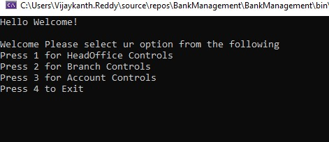
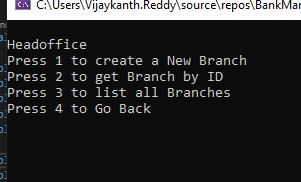
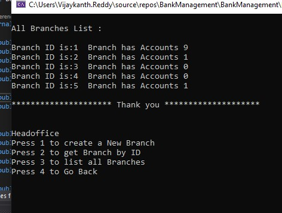
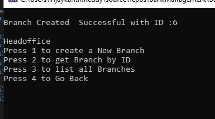
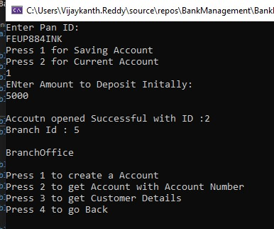
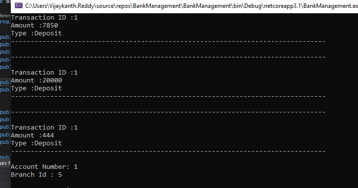
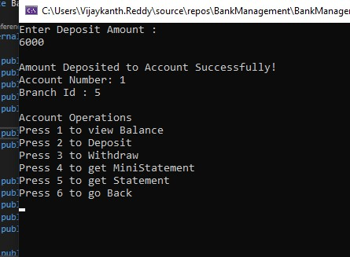

# BankManagement
Work flow
Launcher ->Controller -> business

Images folder is only for ReamMe file not part of the code.

<h1>Home</h1>

<h1>Head Office</h1>

<h1>List of Branchs view</h1>

<h1>New Branch Create</h1>

<h1>New Account Create</h1>

<h1>Mini statement</h1>

<h4>Deposit</h4>

